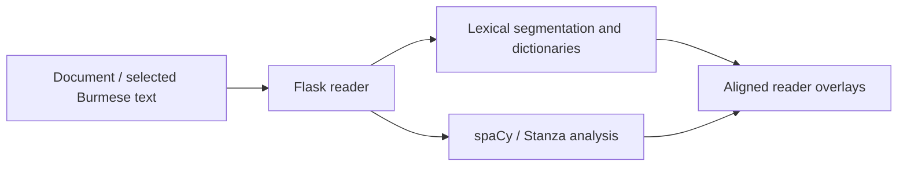

# Burmese Neural Reader

**A deployed reading and linguistic-analysis application for Burmese, with infrastructure for working on a low-resource historical language.**

I built this reader to make Burmese texts easier to investigate at the level of words, grammatical structure, and source documents. It connects language-specific lexical engineering with neural analysis and an interactive reading interface.

[Live reader](https://burmeseneuralreader.com/reader) · [Portfolio](https://github.com/conradcompagna) · [Setup and external resources](docs/SETUP.md)

## Engineering highlights

- **Burmese lexical processing:** layered dictionaries, dynamic-programming segmentation, language-model scoring, and fuzzy lookup with BK-tree/edit-distance search.
- **Neural analysis in context:** a custom spaCy parsing pipeline and Stanza named-entity recognition integrated with dictionary segmentation and visible document spans.
- **A usable research interface:** document import, hover dictionaries, dependency visualization, pronunciation/transliteration, annotations, and reading-review state.
- **Training and evaluation infrastructure:** corpus conversion, spaCy configurations, CRF boundary training, segmentation comparison, and inspection tools retained alongside the deployed application.

## Architecture and code guide

| Area | Starting points |
|---|---|
| Production entrypoint | `wsgi.py`, `newserverPDF21split.py` |
| Lexical scoring and search | `lmbrain.py` |
| Grammatical and pronunciation processing | `dict_pos_override.py`, `ud_overlay.py`, `burmese_transliteration.py` |
| Reading interface | `static/reader.js`, `templates/reader.html`, `dep_tree_view.js` |
| Model and corpus research | `research/`, `training/deployed_spacy_config.cfg` |

The runtime source was taken from the deployed application. `research/` preserves separate preparation and experimental tools from the development workspace; it is not loaded by the production WSGI entrypoint. Those tools include earlier approaches and dataset-specific paths, so they should be read as research infrastructure rather than a single end-to-end training command.

Dictionary files, corpus documents, trained weights, and reading/user state are excluded. The [Konbaung project](https://github.com/conradcompagna/konbaung-knowledge-graph) reuses this reader's lexical stack through an explicit local adapter.

See [publication contents](docs/PUBLICATION.md) and [third-party notices](THIRD_PARTY_NOTICES.md).
