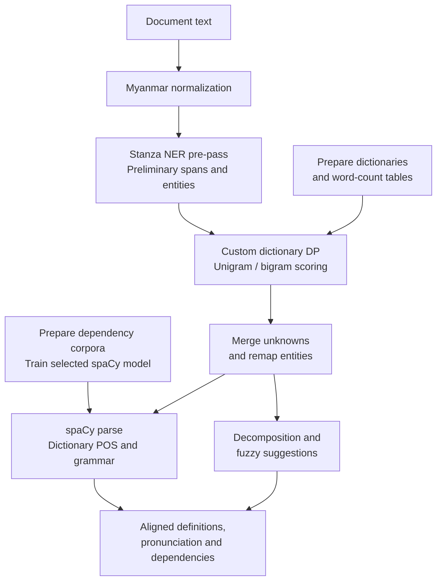

# Burmese Neural Reader

**A deployed Burmese reading application integrating neural parsing, dictionary segmentation, and source-document exploration.**

I built this reader to make Burmese texts easier to investigate at the level of words, grammatical structure, and source passages. The project combines language-specific lexical engineering with neural analysis for a low-resource language.

I prepared dependency corpora and trained the spaCy parser, assembled layered
dictionaries and grammatical rules, and built a custom word segmenter using
unigram and bigram evidence. The application integrates that work with named-entity
recognition, fuzzy lexical search, OCR-text handling and an interactive document reader.

The corpus tools, model configurations, lexical algorithms and evaluation results
below document the work I put into the reader.

## Application

This repository connects the reading application to its corpus builders, trained-model
configurations, lexical algorithms, and evaluation tools. The Flask backend is
organized by feature under `burmese_reader/`; ES modules under `frontend/` provide
the reading interface.

**The custom DP segmenter determines the final word boundaries.** Stanza's NER
pre-pass supplies preliminary spans and entities; contiguous regions are then
resegmented using dictionary and unigram/bigram evidence. The separately initialized
Stanza tokenizer-only path is disabled. See the
[construction story](docs/BUILD_PROCESS.md) and [runtime sequence](docs/BUILD_PROCESS.md#runtime-architecture).

### Engineering highlights

- **Language-specific lexical search:** layered dictionaries, dynamic-programming segmentation, language-model scoring, and BK-tree fuzzy matching over edit distance.
- **Neural analysis in context:** a custom spaCy parsing pipeline and Stanza named-entity recognition integrated with dictionary segmentation and document spans.
- **Interactive close reading:** document import, hover definitions, dependency visualization and pronunciation/transliteration; annotation and review services remain in the code but their public write/review routes are disabled.

### Scope

The project focuses on Burmese: continuous-script word boundaries, grammatical
function words, neural syntax, pronunciation and the irregular text produced by
OCR. Its lexical stack also supports the Konbaung chronicle reader.

### Explore the runtime

| Area | Starting point |
|---|---|
| Application lifecycle and routes | [application.py](burmese_reader/application.py), [HTTP registration](burmese_reader/http.py), [wsgi.py](wsgi.py) |
| Graphemes, dictionary DP and neural merge | [graphemes.py](burmese_reader/graphemes.py), [segmentation.py](burmese_reader/segmentation.py), [pipeline.py](burmese_reader/pipeline.py) |
| Language-model scoring and fuzzy search | [lmbrain.py](lmbrain.py) |
| Grammar and pronunciation | [dict_pos_override.py](dict_pos_override.py), [ud_overlay.py](ud_overlay.py), [burmese_transliteration.py](burmese_transliteration.py) |
| Reading interface | [browser source](frontend/README.md), [templates/reader.html](templates/reader.html) |

The [module guide](docs/architecture/modules.md) maps the backend and reader
interface by responsibility, with entrypoints for lexical search, neural analysis,
annotations, document handling, and rendering.

The [Konbaung Knowledge Graph](https://github.com/conradcompagna/konbaung-knowledge-graph) reuses this reader's lexical stack through an explicit local adapter.

---

## Released Burmese model

The [Burmese POS and dependency model](research/releases/burmese-pos-dependency-spacy/README.md)
contains the trained tok2vec encoder, POS morphologizer and dependency parser used
by the reader. Its model card connects myUDTree corpus preparation, joint training,
checkpoint selection and CPU inference to the downloadable weights.

Re-evaluation on the retained development set reproduces the saved **96.92% POS
accuracy, 92.39% UAS and 89.41% LAS**. The [training record](research/SELECTED_MODEL.md)
gives the full metrics and source identities.

## How it was built

The research record connects corpus preparation, language-specific feature design,
model training, and lexical engineering to the reading application.

**[`research/`](research/)** — start at [research/README.md](research/README.md).

| | |
|---|---|
| [**From resources to the deployed reader**](docs/BUILD_PROCESS.md) | Lexical engineering, statistical segmentation, selected model training and evidence by stage. |
| [**Build chains**](research/pipeline/README.md) | Word segmentation, the sentence-boundary CRFs, the UD pipeline, and the dictionaries — how each was made. Start here. |
| [**What the reader loads**](research/STATUS.md) | Selected model and lexical identities, their construction records, and the status of retained CRF experiments. |
| [**The trained Burmese model**](research/SELECTED_MODEL.md) | Corpus construction, shared tok2vec/POS/parser architecture, and development scores reproduced on the retained evaluation set. |
| [`research/pipeline/`](research/pipeline/) | Corpus construction, CRF training, spaCy configurations, dictionary building. |
| [`research/evaluation/`](research/evaluation/) | Tests, scoring harnesses, and the annotation viewers used to judge output by hand. |
| [`research/components/`](research/components/) | Algorithm modules in standalone form. |
| [`research/experiments/`](research/experiments/) | The development of sentence-boundary features and the transition from a userscript to a full reading application. |

**Selected parser results:** the deployed checkpoint records **96.92% POS accuracy,
92.39% UAS and 89.41% LAS** on its development evaluation; the retained split
contains 4,104 training and 216 development documents. See the
[evaluation and checkpoint record](research/EVIDENCE.md).

A central design challenge is recovering word and sentence boundaries in continuous
Burmese text. The [CRF development case study](research/experiments/sentence-final-particle-crf/OUTCOME.md)
shows how I translated that linguistic problem into corpus construction, grammatical
features, and token-normalization rules designed for running chronicle prose.
