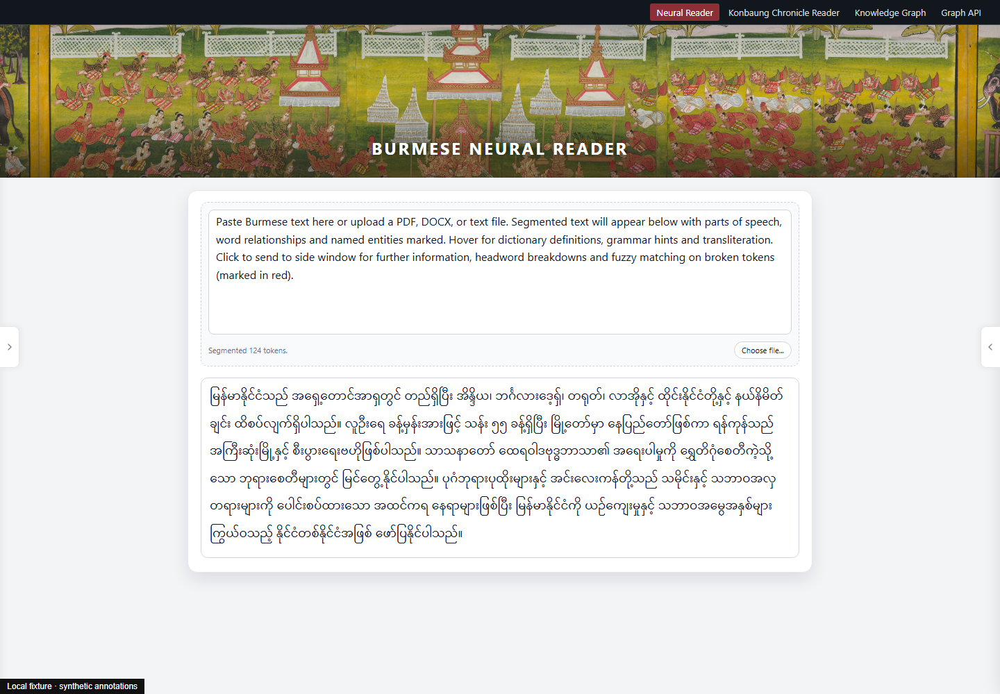

# Burmese Neural Reader

**A deployed Burmese reading application integrating neural parsing, dictionary segmentation, and source-document exploration.**

I built this reader to make Burmese texts easier to investigate at the level of words, grammatical structure, and source passages. The project combines language-specific lexical engineering with neural analysis for a low-resource language.

[Live reader](https://burmeseneuralreader.com/reader) · [Setup](docs/SETUP.md) · [Architecture](docs/ARCHITECTURE.md) · [Portfolio](https://github.com/conradcompagna)

---

## Application

This repository contains the reader source and its offline research. The modular
source preserves the deployed reader's contracts; GitHub changes are not a live
deployment.

### Engineering highlights

- **Language-specific lexical search:** layered dictionaries, dynamic-programming segmentation, language-model scoring, and BK-tree fuzzy matching over edit distance.
- **Neural analysis in context:** a custom spaCy parsing pipeline and Stanza named-entity recognition integrated with dictionary segmentation and document spans.
- **Interactive close reading:** document import, hover definitions, dependency visualization and pronunciation/transliteration; annotation and review services remain in the code but their public write/review routes are disabled.

### Explore the runtime

| Area | Starting point |
|---|---|
| Application lifecycle and routes | [application.py](burmese_reader/application.py), [HTTP registration](burmese_reader/http.py), [wsgi.py](wsgi.py) |
| Graphemes, dictionary DP and neural merge | [graphemes.py](burmese_reader/graphemes.py), [segmentation.py](burmese_reader/segmentation.py), [pipeline.py](burmese_reader/pipeline.py) |
| Language-model scoring and fuzzy search | [lmbrain.py](lmbrain.py) |
| Grammar and pronunciation | [dict_pos_override.py](dict_pos_override.py), [ud_overlay.py](ud_overlay.py), [burmese_transliteration.py](burmese_transliteration.py) |
| Reading interface | [browser source](frontend/README.md), [templates/reader.html](templates/reader.html) |

The [module guide](docs/architecture/modules.md) maps the backend and reader
interface by responsibility, with entrypoints for lexical search, neural analysis,
annotations, document handling, and rendering. The maintained package lives in
`burmese_reader/`; `app.py` preserves the existing server and research import interface.

The [Konbaung Knowledge Graph](https://github.com/conradcompagna/konbaung-knowledge-graph) reuses this reader's lexical stack through an explicit local adapter.

---

## How it was built

The research record connects corpus preparation, language-specific feature design,
model training, and lexical engineering to the reading application.

**[`research/`](research/)** — start at [research/README.md](research/README.md).

| | |
|---|---|
| [**Build chains**](research/pipeline/README.md) | Word segmentation, the sentence-boundary CRFs, the UD pipeline, and the dictionaries — how each was made. Start here. |
| [**What the reader loads**](research/STATUS.md) | Every loaded artefact mapped to the code that produced it, and the four CRF generations with their status. |
| [`research/pipeline/`](research/pipeline/) | Corpus construction, CRF training, spaCy configurations, dictionary building. |
| [`research/evaluation/`](research/evaluation/) | Tests, scoring harnesses, and the annotation viewers used to judge output by hand. |
| [`research/components/`](research/components/) | Algorithm modules in standalone form. |
| [`research/experiments/`](research/experiments/) | The development of sentence-boundary features and the transition from a userscript to a full reading application. |

A central design challenge is recovering word and sentence boundaries in continuous
Burmese text. The [CRF development case study](research/experiments/sentence-final-particle-crf/OUTCOME.md)
shows how I translated that linguistic problem into corpus construction, grammatical
features, and token-normalization rules designed for running chronicle prose.

See [publication contents](docs/PUBLICATION.md) for the source release and separately
provisioned language resources.

## Development and validation

[Development commands](docs/DEVELOPMENT.md) · [Contributing](CONTRIBUTING.md) · [Security](SECURITY.md)

Try the [local fixture demo](docs/SETUP.md), then follow the
[research evidence index](research/EVIDENCE.md) from build decisions to recorded
results and the [reproduction guide](research/REPRODUCIBILITY.md) for checks and new runs.
