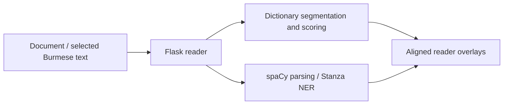

# Architecture

`wsgi.py` initializes dictionaries, the grammar lexicon, spaCy, and Stanza before serving `app.py`. The application owns document handling, segmentation orchestration, and HTTP routes. `lmbrain.py` provides language-model scoring and spelling suggestions; `burmese_transliteration.py`, `dict_pos_override.py`, and `ud_overlay.py` provide language-specific display and grammatical processing.

`templates/reader.html` and `static/reader.js` form the reading interface. The spaCy model package, including its configuration, and dictionary resources are provisioned separately.
