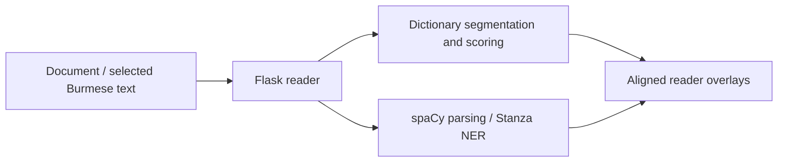

# Architecture

`burmese_reader/application.py` composes the application and initializes resources
explicitly. `wsgi.py` uses that startup path; `app.py` retains named imports for
existing adapters. Feature state is attached to the active Flask application,
with one explicit fallback runtime for legacy command-line callers.

The current lookup path is Stanza tokenization → dictionary DP resegmentation →
unknown-token merging → NER/UD/POS overlays. Older BILU and CRF approaches remain
research evidence, not an alternative startup path silently restored by the split.
See the [module map](architecture/modules.md) for code ownership.

`lmbrain.py` provides language-model scoring and spelling suggestions;
`burmese_transliteration.py`, `dict_pos_override.py`, and `ud_overlay.py` provide
language-specific display and grammatical processing.

`templates/reader.html` and the modules under `frontend/reader/` form the reading
interface. `npm run build` produces the original `static/reader.js` URL. The
[browser map](../frontend/README.md) explains feature ownership, stylesheet order
and the standalone research viewer. Model packages and dictionaries are
provisioned separately.
