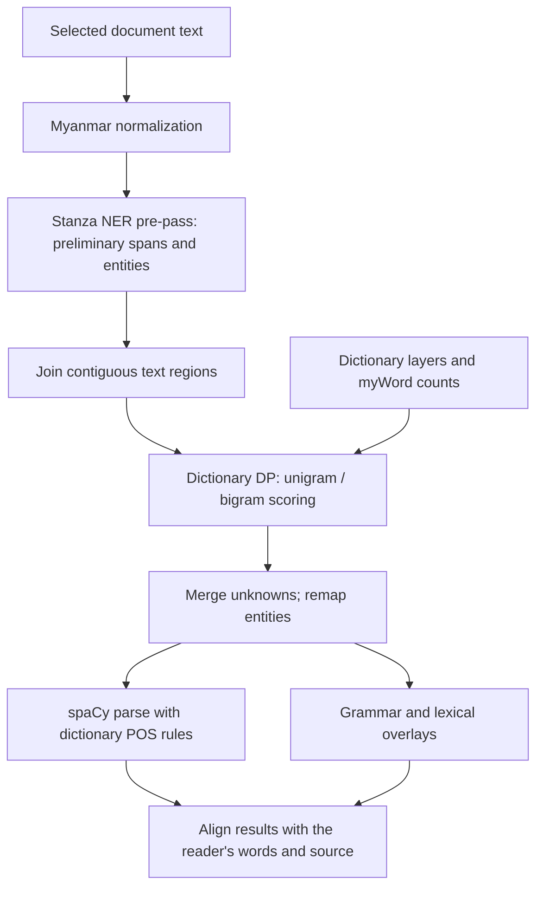

# Reader architecture

The final word boundaries are produced by the custom dictionary/LM DP segmenter.
Neural entity recognition and the trained spaCy parser are integrated around
those boundaries, with explicit remapping back to the source text.

## The request sequence

1. [lookup.py](../burmese_reader/lookup.py) normalizes selected text and coordinates the default full lookup.
2. [ner.py](../burmese_reader/ner.py) runs the combined Stanza NER pre-pass and caches its document; the separate tokenizer-only initializer is disabled.
3. [pipeline.py](../burmese_reader/pipeline.py) joins contiguous preliminary regions and invokes [segmentation.py](../burmese_reader/segmentation.py) across each complete region, including inside NER spans.
4. The custom segmenter scores dictionary candidates with unigram/bigram evidence, then the pipeline merges consecutive unknown segments and remaps entities onto the final words.
5. [ud.py](../burmese_reader/ud.py) and [ud_overlay.py](../ud_overlay.py) construct parser input from those words, collapse entity spans where configured, apply dictionary POS constraints and map dependency results back to reader segments.
6. Definitions, grammar, pronunciation and fuzzy candidates are assembled for the browser; lightweight and exact-lookup modes select smaller portions of this path.

The selected spaCy model contains tok2vec, morphologizer and parser; Stanza provides
NER separately. See the [artifact map](../research/STATUS.md),
[construction process](BUILD_PROCESS.md) and [saved evaluation](../research/EVIDENCE.md).

## Application and browser boundaries

[application.py](../burmese_reader/application.py) composes the application and
initializes resources explicitly. `wsgi.py` uses that startup path; `app.py` is
the small facade for command-line and research adapters. Feature state belongs
to the active Flask application, with a shared runtime for command-line use.

[lmbrain.py](../lmbrain.py) supplies statistical scoring and spelling suggestions;
[burmese_transliteration.py](../burmese_transliteration.py) handles pronunciation.
The [module map](architecture/modules.md) links document import, PDF geometry,
lexical search and annotation responsibilities.

[templates/reader.html](../templates/reader.html) and the modules under
`frontend/reader/` provide the interface. `npm run build` produces the browser
bundle; the [browser map](../frontend/README.md) explains feature ownership.
Model packages, dictionaries and count tables are provisioned separately.
