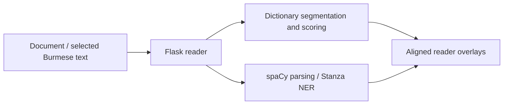

# Architecture

`wsgi.py` initializes dictionaries, the grammar lexicon, spaCy, and Stanza before serving `app.py`. The application owns document handling, segmentation orchestration, and HTTP routes. `lmbrain.py` provides language-model scoring and spelling suggestions; `burmese_transliteration.py`, `dict_pos_override.py`, and `ud_overlay.py` provide language-specific display and grammatical processing.

`templates/reader.html` and `static/reader.js` form the reading interface. Training is separate from the application lifecycle: corpus builders live in `training/corpus/`, CRF boundary workflows in `training/boundaries/`, and spaCy architecture files in `training/configs/`.

`tools/dictionaries/` prepares lexicons. `tools/inspection/` contains focused local inspection interfaces and corpus diagnostics. These tools use their own inputs and are not imported by the WSGI entrypoint.
