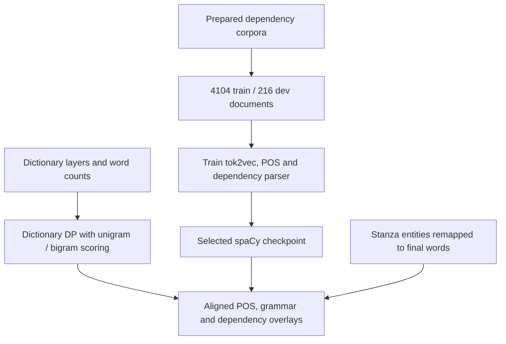

# From Burmese linguistic resources to an interactive reader

I built the reader around the interaction between lexical knowledge, statistical
word segmentation and grammatical analysis. The final word boundaries come from
my dictionary-aware dynamic-programming segmenter, using unigram and bigram
information; neural models add entity and syntactic analysis around that segmentation.

Start with the [runtime map](BUILD_PROCESS.md#runtime-architecture), the [selected resources](../research/STATUS.md)
and the [saved model evaluation](../research/EVIDENCE.md). A
[compact artifact record](../research/pipeline/spacy/deployed_pipeline/selected_checkpoint.json)
identifies the deployed checkpoint, Stanza resources, count tables and retained
training split files checked on 23 September 2026.

## 1. Build a lexical foundation

| Resource | Construction and role |
|---|---|
| Burmese–English Wiktionary | [Kaikki converter](../research/pipeline/dictionaries/kaikki_to_tsv.py) produces entries for the shared reader dictionary. |
| Myanmar–English dictionary (MMD) | [Cleanup script](../research/pipeline/dictionaries/clean_mmd.py) normalizes headwords, removes unsuitable suffixes/entries and records changes. |
| Pali dictionary | Separately supplied `peu.tsv` adds another lexical layer. |
| Grammar lexicon | The hand-built `burmese_grammar_dictionary.tsv` connects function words and grammatical classes to the reader's grammar overlays and research features. |
| Word frequencies and context | `myWord-main/unigram-word.txt` and `bigram-word.txt` supply the selected runtime count tables. |

[Dictionary loaders](../burmese_reader/dictionary_loaders.py) and
[lexicon assembly](../burmese_reader/lexicon.py) combine these resources.
The [chronicle n-gram builder](../research/pipeline/corpus/build_chronicle_ngrams.py)
records a separate corpus-development path; the checked runtime uses the myWord
files identified above.

## 2. Turn lexical and statistical evidence into word boundaries

[segmentation.py](../burmese_reader/segmentation.py) enumerates candidate words
over Burmese grapheme/syllable clusters. Its right-to-left DP scores candidates
using dictionary membership, unigram cost, bigram context and unknown-word/syllable
penalties. It preserves a path back to the selected segments.

The [configuration](../burmese_reader/segmentation_config.py) exposes these
trade-offs; [lmbrain.py](../lmbrain.py) and
[LM initialization](../burmese_reader/lm_runtime.py) supply count-based scoring.
Dictionary words and frequency-only candidates receive different costs, allowing
specialist vocabulary to compete without treating every statistical candidate as
a reliable dictionary entry.

The full lookup has a Stanza **NER pre-pass**, which returns preliminary tokens,
character spans and entities. The standalone tokenizer-only initializer is disabled.
[pipeline.py](../burmese_reader/pipeline.py) concatenates contiguous preliminary
regions and runs the dictionary/LM segmenter across each region, including within
entity spans. It merges consecutive unknown segments, then
[lookup.py](../burmese_reader/lookup.py) remaps the entities onto the resulting words.
The final reader segmentation therefore comes from the custom DP path, rather
than accepting Stanza's preliminary word boundaries as final.

## 3. Prepare supervision and train the selected parser

The [corpus tools](../research/pipeline/corpus/) record CoNLL-U/DocBin conversion,
root repair, constituency-to-dependency conversion and token alignment. The
[spaCy work area](../research/pipeline/spacy/) preserves training configurations,
streaming preparation and pretraining experiments.

The deployed `model-best` configuration names the retained `train_95.spacy` and
`dev_5.spacy` files. Their [split manifest](../research/pipeline/spacy/deployed_pipeline/spacy_docbins_manifest_95_5.json)
records **4,104 training documents and 216 development documents**. The selected
configuration has seed 0, dropout 0.1 and evaluation every 1,000 steps.

The selected pipeline is **tok2vec → morphologizer → parser**. Its matching
[no-NER configuration](../research/pipeline/spacy/deployed_pipeline/joint_ud_morph_parser_no_ner.cfg)
trains POS and dependency analysis; NER is supplied by Stanza in the application.
The retained NER-inclusive configuration is a separate experiment.

### Saved development evaluation

| Metric | Deployed checkpoint metadata |
|---|---:|
| POS accuracy | **96.92%** |
| Unlabelled attachment score (UAS) | **92.39%** |
| Labelled attachment score (LAS) | **89.41%** |
| Sentence-boundary F1 | **93.01%** |

These are the saved development results in the deployed checkpoint's `meta.json`.
All 14 locally retained model files, including the trained components, configuration
and metadata, match the deployed files by SHA-256. The production package also
contains a 200,000 × 300 float32 vector matrix. The artifact record includes its
fingerprint and the retained DocBin identities; it does not substitute those
development scores for an independent test evaluation.

The retained training configuration and deployed configuration differ in their
vector initialization path and equivalent numeric formatting. The
[training record](../research/REPRODUCIBILITY.md) explains the corpus, vector and
training settings alongside the selected checkpoint identity.

## 4. Integrate models around the final segments

The checked Stanza resources are the **ALT tokenizer inside the NER pre-pass,
UCSY NER, UCSY pretrained vectors and OSCAR forward/backward character models**.
All five model-file identities agree with the resource manifest. Their role is
separate from the custom spaCy parser and the application's word-boundary algorithm.

[ud_overlay.py](../ud_overlay.py) constructs spaCy input from the application's
segments, can collapse named-entity spans for parsing, and maps the analysis back
onto the reader's segments. [Dictionary POS rules](../dict_pos_override.py) and
the [grammar overlay](../burmese_reader/grammar.py) add lexical/grammatical knowledge.
The deployed environment uses spaCy 3.8.11, Stanza 1.11.0 and PyTorch 2.6.0+cpu;
these ordinary CPU model loads are distinct from Language Engine's INT8 export system.

## 5. Make damaged text usable in the document

[Myanmar normalization](../burmese_reader/normalization.py), grapheme handling and
contiguous-region boundaries preserve usable text while accommodating OCR damage.
The pipeline keeps unknown material in context, merges unknown runs and offers
dictionary decomposition plus BK-tree fuzzy candidates with language-model scoring.
This is reader-side recovery and analysis of OCR text, not a claim of a separately
trained OCR recognizer in the reader.

Document extraction and browser modules preserve the connection between source
text, lookup spans, definitions, pronunciation and dependency views. The
[module map](architecture/modules.md) links those responsibilities to their
implementations.

## Development branches that explain the design

The [BILU boundary work](../research/pipeline/spacy/bilu/), standalone NER models
and [sentence/OCR-boundary CRFs](../research/pipeline/crf/) preserve substantial
sequence-modeling experiments. The [final-particle case study](../research/experiments/sentence-final-particle-crf/OUTCOME.md)
explains how Burmese grammatical knowledge became features and training-data
transformations. These branches demonstrate iteration; they are not extra models
silently inserted into the selected reader lookup.

## Runtime architecture

### The request sequence

1. [lookup.py](../burmese_reader/lookup.py) normalizes selected text and coordinates the default full lookup.
2. [ner.py](../burmese_reader/ner.py) runs the combined Stanza NER pre-pass and caches its document; the separate tokenizer-only initializer is disabled.
3. [pipeline.py](../burmese_reader/pipeline.py) joins contiguous preliminary regions and invokes [segmentation.py](../burmese_reader/segmentation.py) across each complete region, including inside NER spans.
4. The custom segmenter scores dictionary candidates with unigram/bigram evidence, then the pipeline merges consecutive unknown segments and remaps entities onto the final words.
5. [ud.py](../burmese_reader/ud.py) and [ud_overlay.py](../ud_overlay.py) construct parser input from those words, collapse entity spans where configured, apply dictionary POS constraints and map dependency results back to reader segments.
6. Definitions, grammar, pronunciation and fuzzy candidates are assembled for the browser; lightweight and exact-lookup modes select smaller portions of this path.

The selected spaCy model contains tok2vec, morphologizer and parser; Stanza provides
NER separately. See the [artifact map](../research/STATUS.md) and [saved evaluation](../research/EVIDENCE.md).

### Application and browser boundaries

[application.py](../burmese_reader/application.py) composes the application and
initializes resources explicitly. `wsgi.py` uses that startup path; `app.py` is
the small facade for command-line and research adapters. Feature state belongs
to the active Flask application, with a shared runtime for command-line use.

[lmbrain.py](../lmbrain.py) supplies statistical scoring and spelling suggestions;
[burmese_transliteration.py](../burmese_transliteration.py) handles pronunciation.
The [module map](architecture/modules.md) links document import, PDF geometry,
lexical search and annotation responsibilities.

[templates/reader.html](../templates/reader.html) and the modules under
`frontend/reader/` provide the interface. `npm run build` produces the browser
bundle; the [browser map](../frontend/README.md) explains feature ownership.

## Evidence by stage

| Stage | Engineering work | Record |
|---|---|---|
| Lexical preparation | Layered definitions, grammar classes and statistical word counts | [Dictionary builders](../research/pipeline/dictionaries/), [resource map](../research/STATUS.md), [lexicon assembly](../burmese_reader/lexicon.py). |
| Word boundaries | Grapheme candidates, dictionary-aware DP, unigram/bigram costs and unknown merging | [Segmentation](../burmese_reader/segmentation.py), [LM scoring](../lmbrain.py), [pipeline](../burmese_reader/pipeline.py). |
| Parser training | Corpus conversion, dependency preparation and selected tok2vec/POS/parser configuration | [Corpus tools](../research/pipeline/corpus/), [training record](../research/REPRODUCIBILITY.md), [split and checkpoint metadata](../research/pipeline/spacy/deployed_pipeline/selected_checkpoint.json). |
| Neural integration | Entity remapping, parser alignment and dictionary POS constraints | [NER](../burmese_reader/ner.py), [UD overlay](../ud_overlay.py), [POS rules](../dict_pos_override.py). |
| Reader interaction | Source-document spans, definitions, grammar, pronunciation and dependency views | [Module map](architecture/modules.md), [browser source](../frontend/README.md). |
| Iteration and evaluation | Selected parser results and boundary-model feature development | [Evidence index](../research/EVIDENCE.md), [CRF case study](../research/experiments/sentence-final-particle-crf/OUTCOME.md). |
